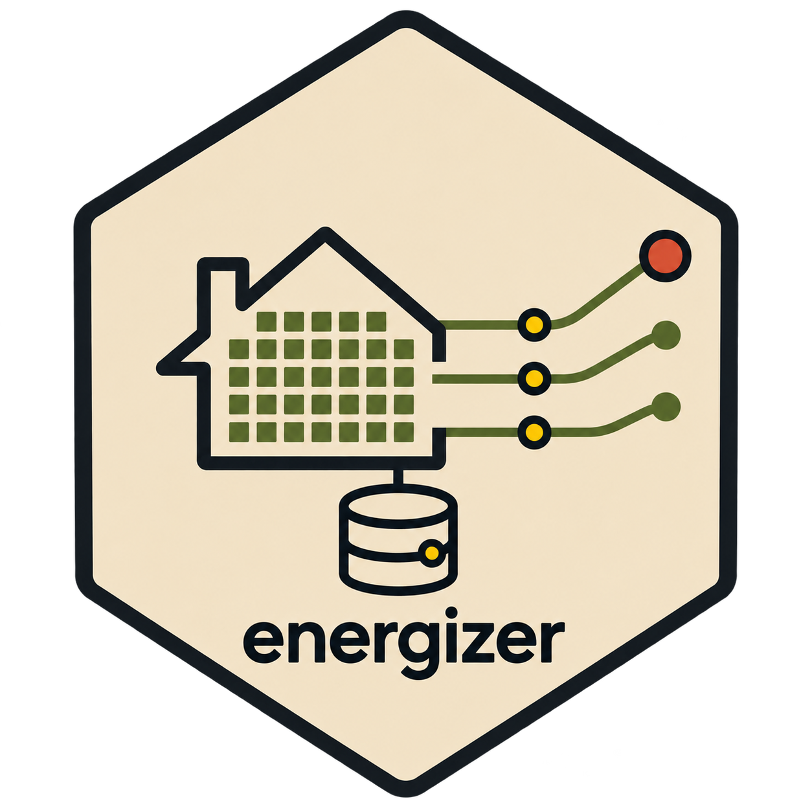

---
output:
  github_document:
    html_preview: false
---

<!-- README.md is generated from README.Rmd. Please edit that file -->

```{r, include = FALSE}
knitr::opts_chunk$set(
  collapse = TRUE,
  comment = "#>",
  fig.path = "man/figures/README-",
  out.width = "100%"
)
```

# energizer <a href="https://gabrielegiraldo.github.io/enrgz/"></a>

<!-- badges: start -->
[](https://github.com/gabrielegiraldo/energizer/actions/workflows/R-CMD-check.yaml)
[](https://app.codecov.io/gh/gabrielegiraldo/energizer)
<!-- badges: end -->

R client for UK government's [Get energy performance of buildings data API](https://get-energy-performance-data.communities.gov.uk/api-technical-documentation). It retrieves EPC and DEC records, searches certificates, tracks changes and downloads monthly full-load datasets.

## Installation

Install development version from GitHub:

```{r, eval = FALSE}
# install.packages("pak")
pak::pak("gabrielegiraldo/energizer")
```

## Authentication

Sign in to service, copy bearer token from **My account**, then set it for current R session:

```{r, eval = FALSE}
energizer::epb_set_token("your-bearer-token")
```

For non-interactive use, set `EPB_BEARER_TOKEN` before starting R. Do not commit token to source control.

## Fetch certificate

```{r, eval = FALSE}
certificate <- energizer::epb_get_certificate(
  "1111-2222-3333-4444-5555"
)
```

## Search certificates

Search domestic, non-domestic or display certificates with API filters:

```{r, eval = FALSE}
domestic <- energizer::epb_search_domestic(
  postcode = "LS1 4AP"
)

non_domestic <- energizer::epb_search_non_domestic(
  council = c("Manchester", "Salford"),
  efficiency_rating = c("F", "G")
)

display <- energizer::epb_search_display(
  date_start = "2025-01-01",
  date_end = "2025-01-31"
)
```

Retrieve all pages or cap result size:

```{r, eval = FALSE}
results <- energizer::epb_search_domestic(
  address = "Liverpool Road",
  paginate = "all",
  max_records = 10000
)

attr(results, "pagination")
```

## Changed certificates

```{r, eval = FALSE}
changes <- energizer::epb_get_deltas(
  "2025-01-01",
  "2025-01-31"
)
```

## Full-load downloads

Monthly full-load datasets can be large. Download ZIP first; extraction is optional:

```{r, eval = FALSE}
energizer::epb_download_domestic(
  format = "csv",
  destination_path = "data"
)

energizer::epb_download_info("domestic", "csv")
```

Recommendation datasets are JSON-only:

```{r, eval = FALSE}
energizer::epb_download_non_domestic_recommendations_json("data")
energizer::epb_download_display_recommendations_json("data")
```

## EPC codes

```{r, eval = FALSE}
energizer::epb_get_codes()
energizer::epb_get_code_info("built_form", key = "NR")
```

## Migration from 0.10.0

| Old function | Replacement |
|---|---|
| `odc_set_key()` | `epb_set_token()` |
| `odc_get_data()` | `epb_get_certificate()` |
| `odc_search_data()` | `epb_search_domestic()`, `epb_search_non_domestic()`, or `epb_search_display()` |
| `odc_bulk_download()` | `epb_download_full_load()` or type-specific download functions |
| `odc_get_file()` / `odc_get_file_list()` | `epb_download_info()` |
| `odc_get_schema()` | `epb_get_codes()` / `epb_get_code_info()` |

Old `odc_*` functions are defunct because old API authentication, LMK-key endpoints and local-authority file listings no longer exist.

## Disclaimer

*This package is not affiliated with or endorsed by UK government.*
